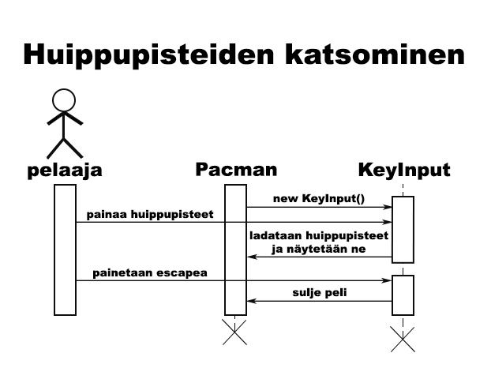

**Aihe:** Pacman peli. Toteutetaan Pacman peli, jossa ohjataan keltaista hahmoa, jonka tarkoitus on kerätä palloja tulematta haamujen syödyksi. Isomman pallon syömällä pelaajalla on hetki aikaa itse saalistaa haamuja, kunnes ne taas lähtee jahtaamaan sinua. Tavoitteena on tyhjentää koko kenttä palloista.

Jokaisesta syödystä pallosta saa 10 pistettä ja isosta pallosta 50 pistettä. Haamujen syömisestä saa kasvavasti pisteitä yhden isomman pallon vaikutuksen aikana. Ensimmäisestä syödystä haamusta saa 200 pistettä, seuraavasta 400, kolmannesta 800 ja viimeisestä 1600. Haamuilla on myös nimet, punainen on Blinky, vaaleanpunainen on Pinky, vaaleansininen on Inky ja oranssi on Clyde.

**Käyttäjät:** Pelaaja

**Pelaajan toiminnot:**
- pelin aloittaminen
- hahmon ohjaaminen

**Ideoita:**
- Mahdollisesti useampi taso, jotka vaikeutuvat entisestä
- Ehkä erilaisia layoutteja
- Haamut jahtaavat eri tavalla, joku tähtää eteenpäin jne
- Mahdollisesti yritän myös animoida haamuille ja pacmanille pieniä animaatioita ja esim silmien liikkeitä
- Kentälle ilmestyy ylimääräisiä syötäviä, kuten hedelmiä tai marjoja, joista saa lisää pisteitä
- Äänimaailmasta en tiedä vielä onnistuuko toteutus, mutta jos jää aikaa, niin jotain voisi tehdä

### Luokkakaavio

